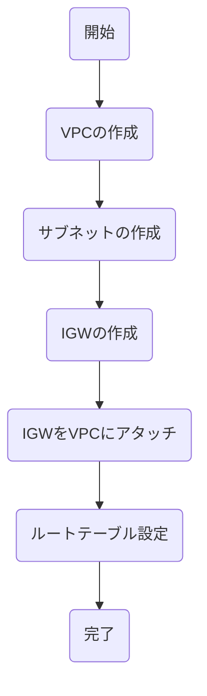

- リージョン
  - AWSの各サービスが提供している地域のこと
- アベイラビリティゾーン
  - 独立したデータセンターのこと、一つが稼働できなくても他のアベイラビリティゾーンで稼働できる
- VPC
  - AWS上に仮想ネットワークを作成できるサービス
- サブネット
  - VPCを細かく区切ったネットワーク
- IPアドレス
  - ネットワーク上の機器を識別するための住所
  - ネットワーク部とホスト部を区分けすることで範囲を表記
- インターネットゲートウェイ

# セクション3: AWSネットワーク構築の実践

## 💡 3行要約
- **VPC**でクラウド上に「自分の土地」を確保し、**サブネット**で「部屋」に区切るのがネットワーク構築の第一歩。
- **IPアドレス (CIDR)** は「住所」のようなもので、`/16` や `/24` という表記で「土地の広さ（使える住所の数）」を決める。
- **インターネットゲートウェイ (IGW)** は、VPCという閉じた空間からインターネットに出るための「玄関（ドア）」である。

## 🔑 重要な概念の解説

### 1. IPアドレスとCIDR（サイダー）
IPアドレスはネットワーク上の「住所」です。AWSでは `10.0.0.0/16` のような表記（CIDR表記）を使って、範囲を指定します。

* **表記の仕組み**: `10.0.1.5` のようなIPアドレスを、どこで区切るか？
    * **ネットワーク部**: 「東京都港区...」まで（どのエリアか）
    * **ホスト部**: 「...1丁目1番地」 （そのエリア内の個別の家）
* **`/16` や `/24` の意味**:
    * `/16`: ネットワーク部が短い ＝ **ホスト部が長い** ＝ **使える住所（IP）がたくさんある**（例：VPC全体）
    * `/24`: ネットワーク部が長い ＝ **ホスト部が短い** ＝ **使える住所（IP）が少ない**（例：サブネット）

### 2. インターネットゲートウェイ (IGW)
VPCを作っただけでは、外（インターネット）とは繋がりません。完全に隔離された密室です。
そこに**「玄関（出入り口）」**を取り付けて、インターネットと通信できるようにする部品がインターネットゲートウェイです。
* [cite_start]**作成手順**: 作るだけではダメで、**「VPCにアタッチ（くっつける）」**必要があります [cite: 36]。

## 🛠 ネットワーク構築の流れ (Mermaid)
最新のUI手順書に基づいた、実際の構築フローです。

