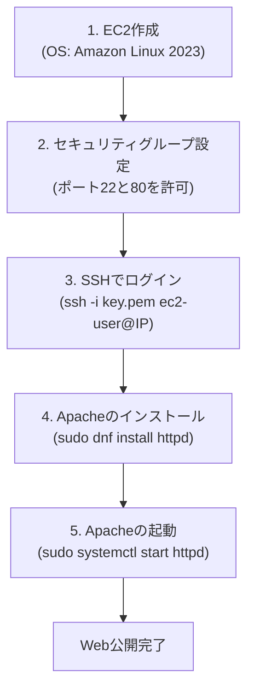

- EC2とは
  - AWSクラウド上の仮想サーバー
- インスタンス
  - EC2からたてられたサーバーのこと
- AMI
  - インスタンス軌道に必要な情報が入った、サーバーのテンプレートのようなもの
- インスタンスタイプ
- ストレージ
  - サーバーにくっつけるデータの保存場所
- サーバーにログイン
  - サーバーに入って、自分のPCから操作すること
  - EC2にログインする時はSSHを使用する
- ポート番号
- Apatch
- ファイアウォール

# [[EC2]]によるWebサーバー構築

## 💡 3行要約
- **[[EC2]]** はAWS上の仮想サーバーで、**[[AMI]]**（OSの金型）と**[[インスタンスタイプ]]**（スペック）を選んで作成する。
- サーバーを外敵から守るために **[[セキュリティグループ]]**（ファイアウォール）を設定し、必要な**ポート（窓口）**だけを開ける。
- 作成したEC2に **[[SSH]]** でログインし、**[[Apache]]** というソフトを入れることでWebサーバーとして機能する。

## 🔑 重要な概念の解説

### 1. サーバーの「スペック」と「金型」
EC2を作るときは、以下の2つを選ぶことから始まります。
- **[[AMI]] (Amazon Machine Image)**: サーバーの「金型（テンプレート）」。OS（WindowsやLinux）やソフトが入っている。
  - ※最新の推奨は **Amazon Linux 2023** です。
- **[[インスタンスタイプ]]**: サーバーの「スペック（性能）」。CPUやメモリの量で決まる。
  - 学習用には **`t2.micro`**（無料利用枠の対象）がよく使われます。

### 2. セキュリティグループとポート番号
サーバーはインターネット上の「家」のようなものです。
- **[[セキュリティグループ]]**: 家の周りの「ファイアウォール（見えない壁）」。
- **[[ポート番号]]**: 壁に開ける「窓口（ドア）」。番号によって役割が違う。
  - **22番 (SSH)**: 管理者が遠隔操作するための「裏口」。
  - **80番 (HTTP)**: Webサイトを一般公開するための「正面玄関」。
  - ※Webサーバーにするなら、この2つを許可（Open）にする必要があります。

### 3. Webサーバーソフト (Apache)
EC2を立てただけでは、ただの空っぽの箱です。
Webサイトを表示できるようにするために、**[[Apache]]**（アパッチ）というWebサーバーソフトウェアをインストールして起動させます。

## 🛠 Webサーバー構築フロー (Mermaid)

